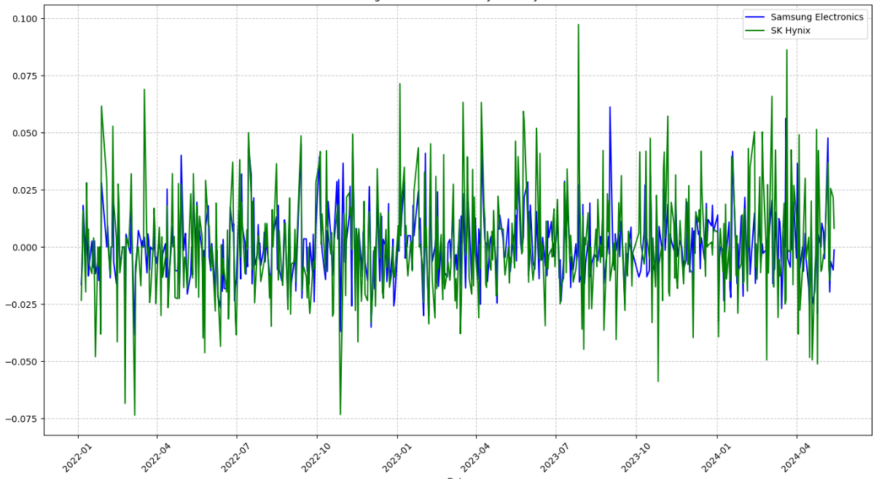
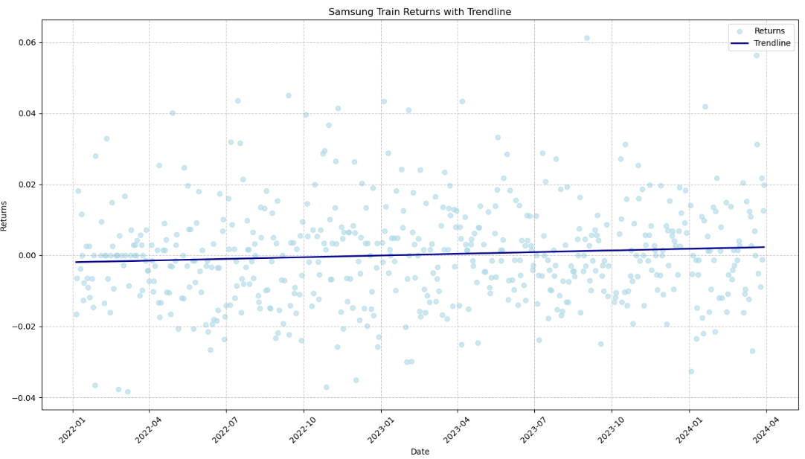
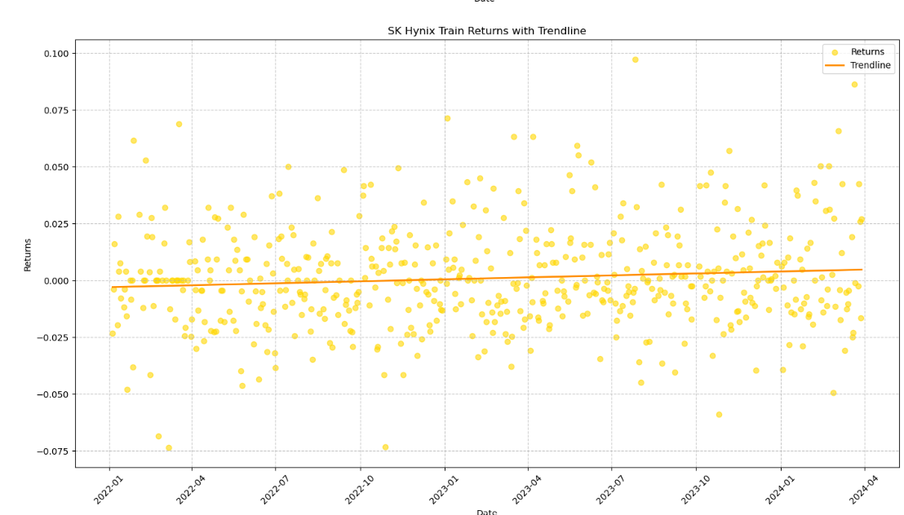
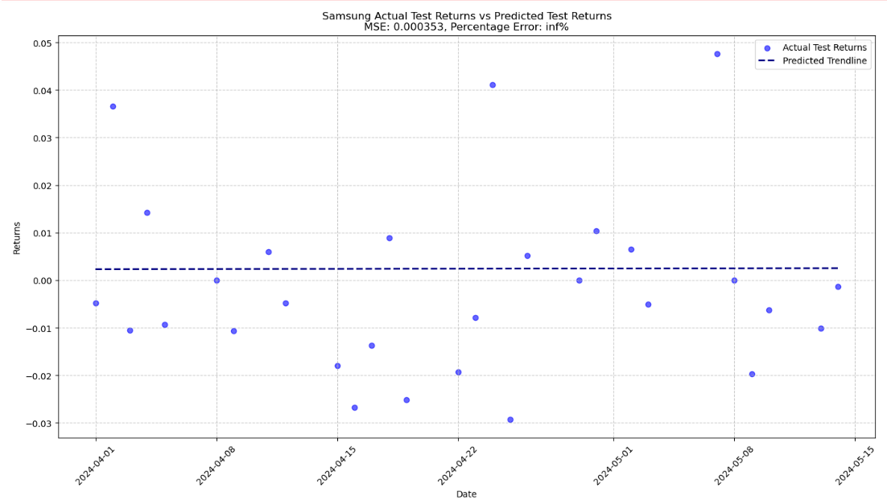
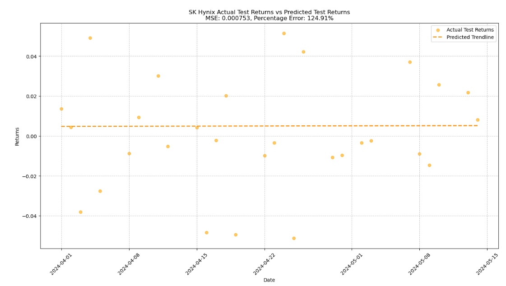
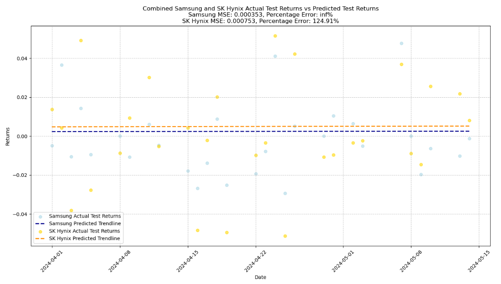

# 프로젝트 프레젠테이션 1

## 1. 프로젝트 모티베이션
주가 예측은 금융 시장에서 중요한 역할을 하며, 개인 투자자와 기관 투자자 모두에게 중대한 의미를 갖는다. 주식 시장은 다양한 요인에 의해 영향을 받는 복잡한 시스템이다. 경제적 지표, 기업 실적, 정치적 사건, 심지어 자연 재해까지도 주가에 영향을 미칠 수 있다. 이런 불확실성 속에서 투자자들은 정보를 바탕으로 미래의 주가 변동을 예측하려고 한다. 투자 의사 결정 지원, 위험 관리, 경제 안정화 등에 주가 예측은 중요한 작용을 한다. 주가 예측에는 기본적 분석와 기술적 분석이 있으며, 기술적 분석은 과거의 주가와 거래량 데이터를 분석하여 미래의 가격 변동을 예측하는 방법이다. 차트와 통계적 도구를 사용하여 시장의 패턴을 식별하는 기술적 지표를 활용하여 예측 모델의 성능을 개선하는 것이 주요 목표이다.

## 2. 데이터 획득 방법
-주가 데이터는 Yahoo Finance의 yfinance 라이브러리를 사용하여 삼성전자의 주가 데이터를 다운로드함. 
-데이터 범위: 2022년 5월 15일~ 2024년 5월 15일

-데이터는 다음과 같은 정보들을 포함한다.
 - Open (시가)
 - High (최고가)
 - Low (최저가)
- Close (종가)
 - Volume (거래량)

## 3. 모델
이 프로젝트에서는 선형 회귀 모델을 사용하여 주가를 예측하고, 각 모델은 다양한 특성(features)을 사용하여 성능을 비교하였다.

### 3.1. 기본 모델 (Basic Model)
- 특성(features): Open, High, Low, Volume
- 모델: Linear Regression
- 평가 지표: Mean Squared Error (MSE)

### 3.2. 개선된 모델 1 (Improved Model 1)
- 추가 특성: RSI (Relative Strength Index)
- 모델: Linear Regression
- 평가 지표: Mean Squared Error (MSE)

- RSI(상대강도지수) : 현재 추세의 강도를 백분율로 나타내어 언제 주가 추세가 전환될 것인가를 예측하는데 유용한 지표이다. RSI는 시장가격 변동폭 중에서 시장가격의 상승폭이 어느 정도인지를 분석하는 것으로 주가가 상승추세일 경우 얼마나 강한 상승세인지, 하락추세라면 얼마나 강한 하락세인지를 퍼센트로 나타낸다. 일반적으로 RSI 값이 70 이상이면 과매수 상태로 간주되어 주가가 곧 하락할 가능성이 높음을 의미한다.
RSI 값이 30 이하이면 과매도 상태로 간주되어 주가가 곧 상승할 가능성이 높음을 의미한다.

### 3.3. 개선된 모델 2 (Improved Model 2)
- 추가 특성: MA50 (50일 이동 평균), MA200 (200일 이동 평균)
- 모델: Linear Regression
- 평가 지표: Mean Squared Error (MSE)

- 이동평균선: 주가이동평균선(Moving Average)은 일정 기간 동안의 주가를 산술 평균한 값을 차례로 연결하여 만든 선으로, 주가의 평균치를 나타내는 지표이다. 주가이동평균선은 주가의 변동성을 줄이고, 주가의 전반적인 추세를 파악하는 데 유용하다

### 3.4. 개선된 모델 3 (Improved Model 3)
- 추가 특성: MACD (Moving Average Convergence Divergence), MACD Signal
- 모델: Linear Regression
- 평가 지표: Mean Squared Error (MSE)

- 이동평균수렴·확산지수: MACD는 주가의 두 이동평균 간의 차이를 이용하여 주가의 추세와 강도를 파악하고, 이를 통해 매매 신호를 제공하는 데 유용하다.

## 4. 퍼포먼스
각 모델의 성능을 Mean Squared Error (MSE)를 통해 평가.
MSE는 예측값과 실제값 간의 차이를 제곱하여 평균한 값으로, 값이 작을수록 모델의 예측 정확도가 높음을 의미함

### 4.1. 기본 모델 (Basic Model)
- MSE: 112286.74

### 4.2. 개선된 모델 1 (Improved Model 1)
- MSE: 92539.80

### 4.3. 개선된 모델 2 (Improved Model 2)
- MSE: 92455.90

### 4.4. 개선된 모델 3 (Improved Model 3)
- MSE: 101453.07

## 5. 결론
- 기본 모델은 시가, 최고가, 최저가, 거래량만을 사용하여 주가를 예측했기 때문에 성능이 제한적
- RSI를 추가한 개선된 모델 1은 주가 예측에 유용한 정보를 제공하여 성능이 향상
- 이동 평균을 추가한 개선된 모델 2는 약간의 성능 향상을 보임
- MACD를 추가한 개선된 모델 3은 오히려 과적합의 가능성으로 인해 성능 하락
- MSE는 모든 모델에서 높게 나타남. 이는 복잡한 주가를 선형 관계로 파악한 것에거 기인한 것으로 보임.

## 6. 랜덤 포레스트 모델 적용
기존의 선형 회귀 모델의 한계를 극복하고 예측 성능을 향상시키기 위해  데이터의 복잡한 비선형 패턴을 더 잘 포착할 수 있는 랜덤 포레스트 회귀(Random Forest Regressor) 모델을 적용하였다. 랜덤 포레스트는 다수의 결정 트리를 사용하여 예측 성능을 개선하는 앙상블 학습 방법이다. 

### 6.1. 기본 모델 (Basic Model) - 랜덤 포레스트
- 특성(features): Open, High, Low, Volume
- 모델: Random Forest Regressor
- 평가 지표: Mean Squared Error (MSE)
- MSE: 61789.32

### 6.2. 개선된 모델 1 (Improved Model 1) - 랜덤 포레스트
- 추가 특성: RSI (Relative Strength Index)
- 모델: Random Forest Regressor
- 평가 지표: Mean Squared Error (MSE)
- MSE: 54789.12

### 6.3. 개선된 모델 2 (Improved Model 2) - 랜덤 포레스트
- 추가 특성: MA50 (50일 이동 평균), MA200 (200일 이동 평균)
- 모델: Random Forest Regressor
- 평가 지표: Mean Squared Error (MSE)
- MSE: 54567.34

### 6.4. 개선된 모델 3 (Improved Model 3) - 랜덤 포레스트
- 추가 특성: MACD (Moving Average Convergence Divergence), MACD Signal
- 모델: Random Forest Regressor
- 평가 지표: Mean Squared Error (MSE)
- MSE: 58345.21

## 7. 결론 - 랜덤 포레스트
- 랜덤 포레스트 모델을 사용함으로써 모든 모델에서 MSE가 크게 감소하였으나, 여전히 MSE가 높은 편으로 나타난다.
- 랜덤 포레스트 모델의 MSE가 선형 회귀 모델보다 낮은 이유는 비선형 관계 학습, 앙상블 방법의 장점, 변동성과 노이즈 감소, 특성 간의 상호작용 포착, 과적합 방지 등 여러 가지 이유로 보이며, 이러한 특성 덕분에 랜덤 포레스트 모델은 주가 예측과 같은 복잡한 문제에서 더 나은 성능을 발휘할 수 있다. 

---

# 프로젝트 2

## 모티베이션

이 프로젝트의 주요 동기는 삼성전자와 SK하이닉스 두 주요 한국 기업의 일일 수익률을 과거 주가 데이터를 사용하여 분석하고 예측하는 것이다. 선형 회귀 모델을 활용하여 주식 수익률의 추세를 이해하고 실제 수익률과 예측된 수익률을 비교하고자 한다.

## 데이터 획득
이 프로젝트의 데이터는 yfinance 라이브러리를 사용하여 Yahoo Finance에서 2022년 1월 1일부터 2024년 5월 15일까지 삼성전자(Ticker: 005930.KS)와 SK하이닉스(Ticker: 000660.KS)의 일일 주가 데이터를 가져온다. 

데이터 가져오기: yfinance.download 메서드를 사용하여 주어진 날짜 범위에 대한 과거 주가 데이터를 가져온다.
수익률 계산: 종가의 백분율 변화를 계산하여 일일 수익률을 계산하고, 백분율 변화 계산에서 발생하는 NaN 값은 제외한다. 

### 두 주식 수익률 비교

### 30일 평균 수익률 비교

## 모델
주식 수익률을 예측하기 위해 선형 회귀 모델을 사용. 모델은 주식의 일일 수익률에 대해 학습하고 테스트 데이터에 대한 수익률을 예측하는 데 사용.

### 모델링 과정
Train data-Test data: 삼성전자와 SK하이닉스 수익률의 데이터를 학습과 테스트 세트로 분할하며, 95%의 데이터를 학습에 사용하고 5%를 테스트에 사용
Linear Regression: 선형 회귀를 통한 데이터 분석
시각화: 실제 수익률과 예측된 수익률을 시각화하여 모델의 성능을 평가. 각 주식에 대해 별도의 그래프를 그리고,  두 주식의 성과를 비교하는 그래프를 그린다.

## 성능 평가
모델의 성능은 다음 지표를 사용하여 평가됨
평균 제곱 오차(MSE): 실제 수익률과 예측된 수익률 간의 평균 제곱 차이를 측정하는 지표
백분율 오차: 실제 수익률과 예측된 수익률 간의 평균 백분율 오차를 측정하는 지표

**그래프**
 - **1. Samsung Train Returns with Trendline**: 삼성전자의 학습 수익률에 대한 산점도와 선형 회귀 추세선.

   

 - **2. SK Hynix Train Returns with Trendline**: SK하이닉스의 학습 수익률에 대한 산점도와 선형 회귀 추세선.

   
 
 - **3. Samsung Actual Test Returns vs Predicted Test Return**: 삼성전자의 실제 테스트 수익률과 예측된 수익률 비교 플롯과 해당 추세선.

   
 
 - **4. SK Hynix Actual Test Returns vs Predicted Test Returns**: SK하이닉스의 실제 테스트 수익률과 예측된 수익률 비교 플롯과 해당 추세선.

   
 
 - **5. Combined Samsung and SK Hynix Actual Test Returns vs Predicted Test Returns**: 삼성전자와 SK하이닉스 모두의 실제 및 예측 수익률을 동일한 그래프에 나타냄

   

## 결론

Linear Regression을 통한 모델의 MSE는 매우 높게 나왔는데, 다음과 같은 이유를 들 수 있다.

1. **주식 수익률의 변동성**: 주식 시장의 큰 변동성으로 인해 단순 선형 회귀 모델로는 정확한 예측이 어려울 수 있다
2. **비선형 관계**: 주식 수익률의 비선형적 패턴이 선형 회귀에 적합하지 않을 수 있다
3. **외부 요인**: 주식 가격은 다양한 외부 요인(경제 지표, 뉴스, 이벤트 등)에 영향을 받는데, 위 모델은 이러한 외부 요인의 영향을 반영하지 않았다
